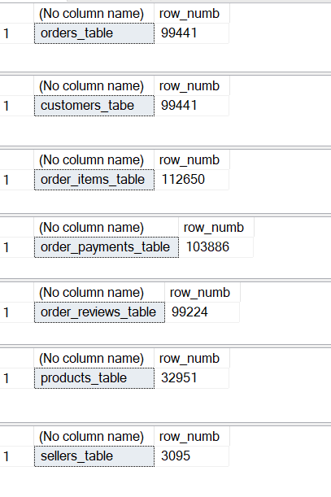
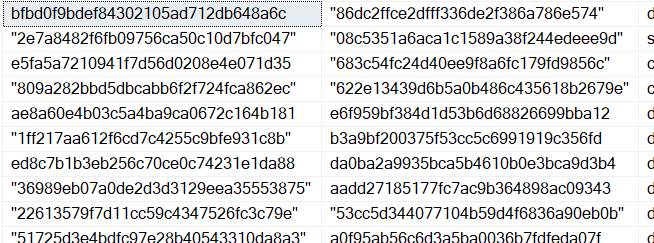
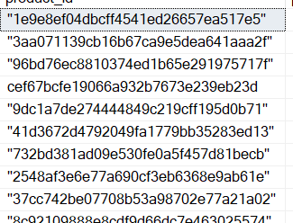
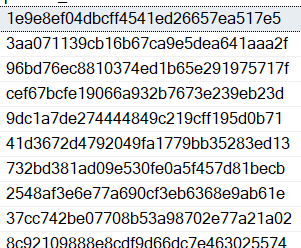
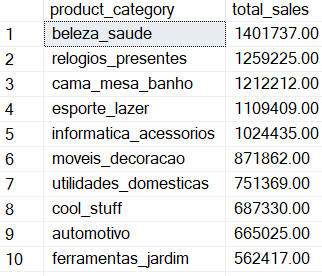
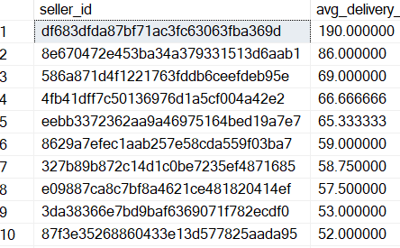

# olist-medallion-pipeline

This is a small data pipeline I built in **MS SQL Server (T-SQL)** on the
[Olist Brazilian E-Commerce dataset](https://www.kaggle.com/datasets/olistbr/brazilian-ecommerce).
It follows the **Medallion Architecture** — Bronze (raw), Silver (clean), Gold
(analytics) — and ends with three reports answering simple business questions
about sales, delivery times, and where the orders come from.

# How it's organised

```
olist-medallion-pipeline/
├── sql_scripts/
│   ├── 00_setup.sql                 -- database, schemas, partitioning
│   ├── 01_bronze_ingestion.sql      -- raw tables
│   ├── 02_silver_transformation.sql -- cleaning + calculated columns
│   ├── 03_gold_analytics.sql        -- window functions + KPI table
│   └── 04_reporting_queries.sql     -- the three reports
├── images/                          -- screenshots used in this README
└── README.md
```

Run the scripts in order: `00` → `01` → `02` → `03` → `04`.

# The three layers

**Bronze** is the raw data, loaded exactly as it comes from the CSVs.
**Silver** is the cleaned version (quotes stripped, calculated columns added,
only delivered orders kept). **Gold** is the analytics built on top of Silver.

# Loading the data

I didn't use `BULK INSERT`. I created the bronze tables first (`01_bronze_ingestion.sql`),
then loaded each CSV with the **SSMS Import Wizard** (right-click the database →
Tasks → Import Flat File). It's the simplest way to get the files in and it
handled the review comments file (which has line breaks inside the text) without
any trouble.

Row counts after loading the raw data into bronze:



# Cleaning notes

**The quotes problem.** A lot of the text columns came in wrapped in extra
double-quote characters, like `"1e9e8ef0..."` instead of `1e9e8ef0...`. If I
left them, the joins between tables wouldn't match. So in the Silver layer I
strip them with `REPLACE(column, '"', '')`.

Before (raw bronze) and after (clean silver):





**The 1899 dates.** In the orders table, the columns `order_approved_at`,
`order_delivered_carrier_date` and `order_delivered_customer_date` are supposed
to be empty for some orders. But empty date cells came through as
`1899-12-30` instead of being blank. I fixed this by turning those `1899-12-30`
values back into `NULL`, so the delivery-time calculation only runs on orders
that were actually delivered.

**Missing categories.** Some products have no category. Instead of dropping
them, I label them `'unknown'` in Silver, so the sales totals still add up and
you can see how much revenue is uncategorised.

**Nulls and duplicates check.** I checked every table for duplicate keys and
for nulls before building the silver layer. No real duplicates anywhere. The
only nulls are the genuine ones in orders (some orders were never approved or
delivered):


# Partitioning

The exercise asks for the tables to be partitioned by date. SQL Server
partitions on a single column, so I partition the orders table on
`order_purchase_timestamp` with one boundary per month (the data runs from
Sep 2016 to Oct 2018). I also keep plain `year`, `month`, `day` columns on the
tables so they're easy to filter and group by.
## Calculated columns (Silver)

| Column | How it's calculated |
| `total_price` | `price + freight_value` |
| `profit_margin` | `price - freight_value` |
| `delivery_time_days` | days between purchase and delivery |

# Gold tables

- **cumulative_sales_per_customer** — running total of spend per customer over
  time (`SUM() OVER (PARTITION BY customer ORDER BY date)`).
- **rolling_avg_delivery_time** — average delivery time over the last 3 orders
  in each category (`AVG() OVER (... ROWS BETWEEN 2 PRECEDING AND CURRENT ROW)`).
- **kpi_summary** — one table holding the three KPIs (sales per category,
  average delivery per seller, orders per state), summarised per month.

# The reports

**1. Top product categories by sales.** Sales are concentrated in a few
categories — health & beauty leads, followed by watches/gifts and bed-bath-table.
A long tail of smaller categories makes up the rest.



**2. Average delivery time per seller.** Most sellers deliver in about 8–15 days.
A few show very high averages (up to ~190 days), but those are low-volume sellers
where a single late order pulls the average up — so it's worth reading this
alongside how many orders each seller actually had.



**3. Orders per state.** Heavily concentrated in the southeast. São Paulo (SP)
alone has about 40,500 orders — more than three times the next state — and
SP, RJ and MG together make up most of the orders.


